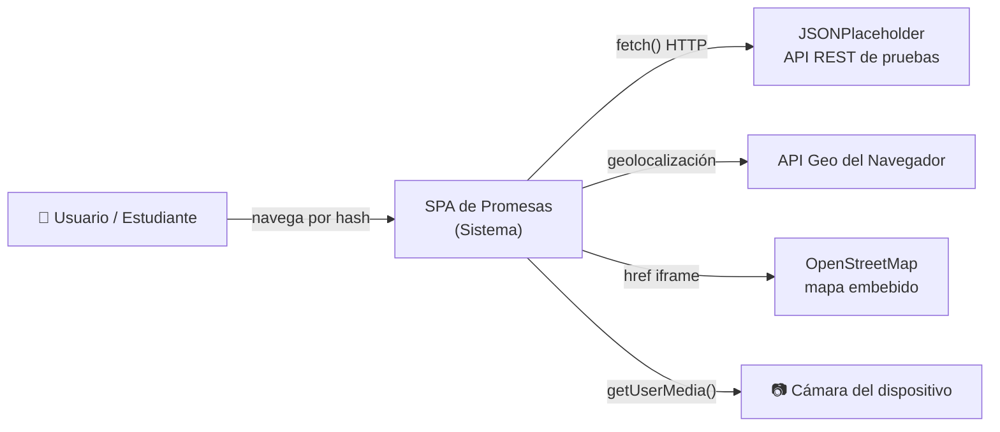
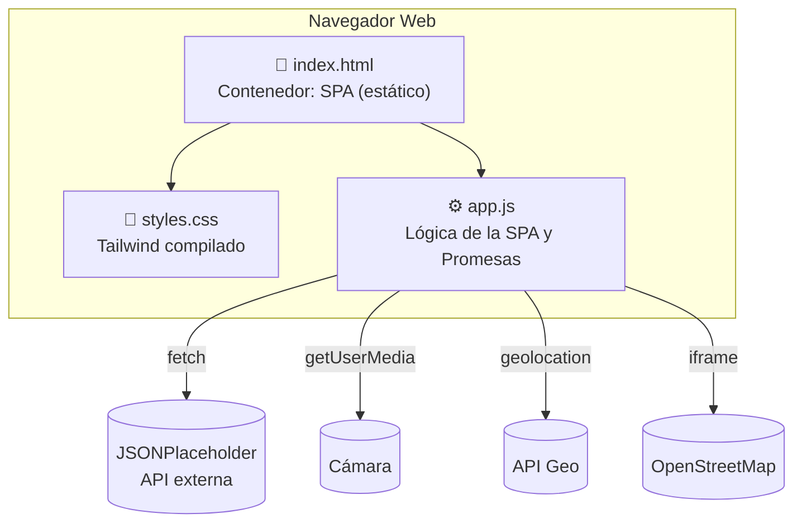
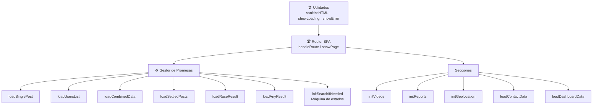
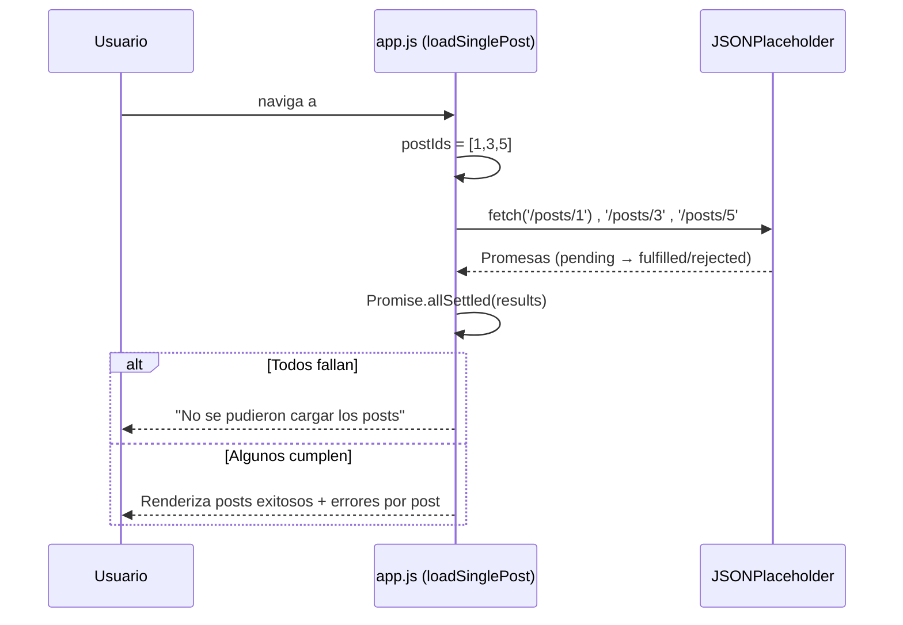
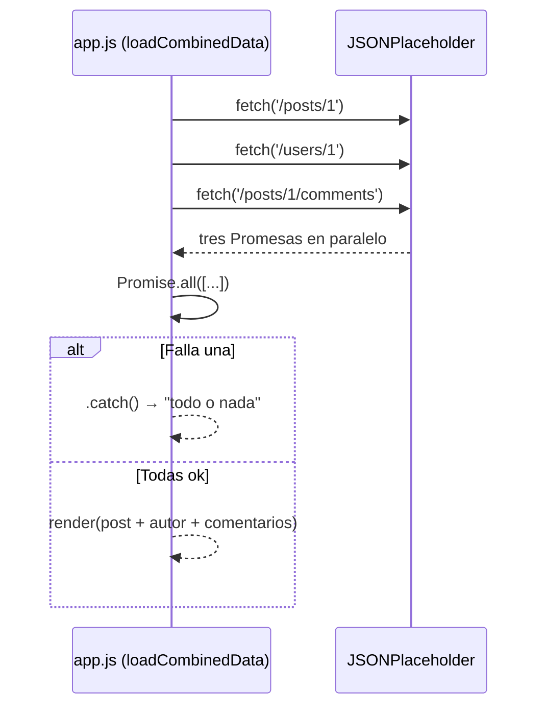

# Arquitectura del Sistema — Modelo C4

Este documento describe la arquitectura de la SPA de Promesas con el **Modelo C4** (Contexto, Contenedor, Componente). Al ser una aplicación en **JavaScript Vanilla** (programación funcional, sin clases/OOP), no se documentan diagramas de clases; se usan **C4** + **diagramas de flujo (Mermaid)**.

---

## 🌐 Nivel 1 — Contexto (C1)

Muestra el sistema como una caja negra y sus actores/sistemas externos.

| Elemento | Descripción |
|----------|-------------|
| **Usuario/Estudiante** | Persona que interactúa con la SPA para aprender Promesas |
| **SPA de Promesas (Sistema)** | Aplicación de una sola página en JS Vanilla + Tailwind |
| **JSONPlaceholder** | API REST gratuita que entrega posts, usuarios, comentarios, álbumes y todos |
| **API de Geolocalización** | API del navegador (`navigator.geolocation`) para latitud/longitud |
| **OpenStreetMap** | Mapa embebido para mostrar la ubicación del usuario |
| **Cámara** | `navigator.mediaDevices.getUserMedia()` para captura de fotos |

---

## 🧱 Nivel 2 — Contenedor (C2)

Muestra los contenedores (piezas ejecutables) que forman el sistema.

| Contenedor | Tipo | Descripción |
|------------|------|-------------|
| `index.html` | Archivo estático (SPA) | Estructura, sidebar de navegación y secciones de las 11 páginas |
| `styles.css` | CSS compilado | Estilos Tailwind generados localmente con PostCSS |
| `app.js` | JavaScript (cliente) | Router por hash, gestión de Promesas y toda la lógica |

---

## 🔩 Nivel 3 — Componente (C3)

Detalla los componentes lógicos internos de `app.js`.

| Componente | Responsabilidad |
|------------|-----------------|
| **Router SPA** | Lee el hash y muestra la sección activa (`handleRoute`, `showPage`, `updatePageTitle`) |
| **Utilidades** | Funciones puras de apoyo: saneado de HTML, estados de carga y error |
| **Gestor de Promesas** | 7 funciones demostrando cada patrón de Promise |
| **Secciones** | Cámara, reportes, geolocalización, contacto y dashboard |

---

## 🔁 Nivel 4 — Flujo de datos (C4 funcional: secuencias)

Como el paradigma es funcional y no orientado a objetos, el nivel 4 se representa con **diagramas de secuencia/flujo** en vez de clases.

### Flujo carga de un post individual

### Flujo combinación con Promise.all

---

*Documentación de arquitectura C4 generada como parte del entregable (Fase 3). Diagramas en Mermaid renderizables en GitHub.*
