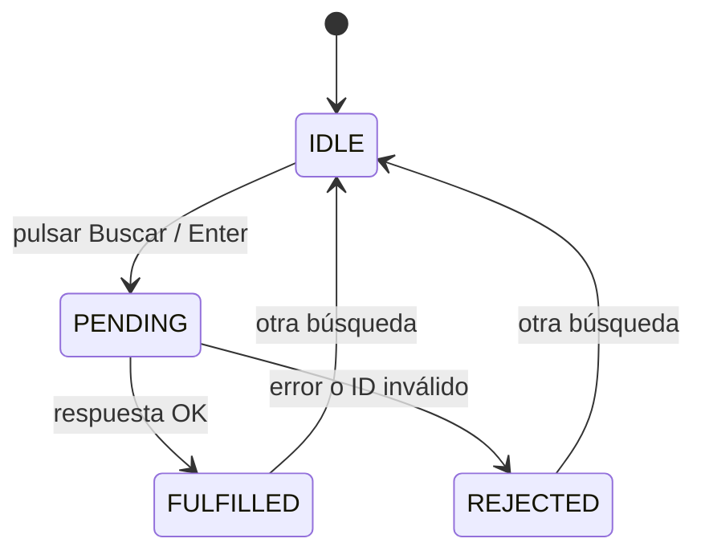
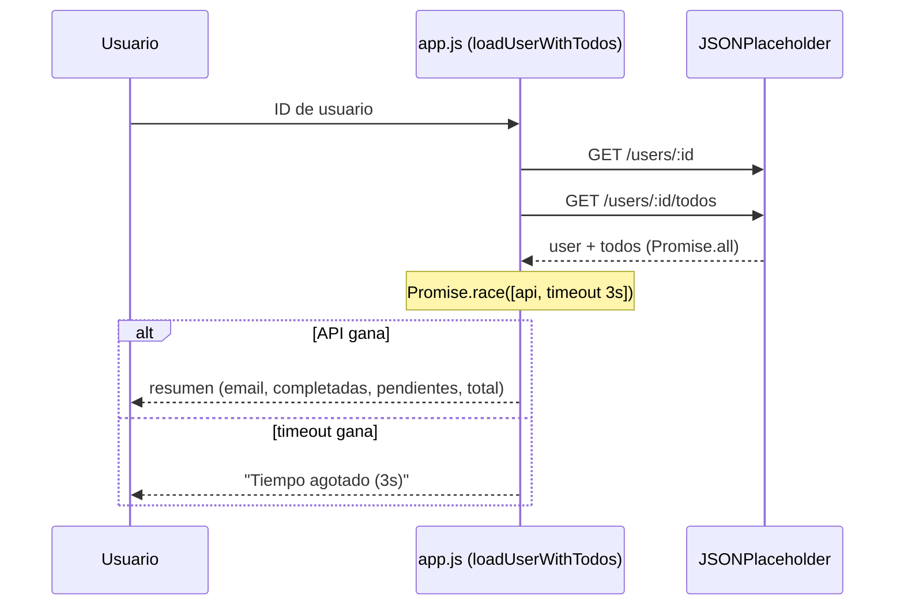
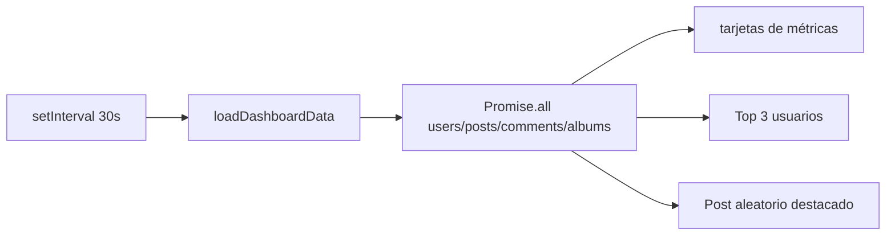

# Módulo Avanzado: race, any, máquina de estados, videos, reportes y dashboard

Documento técnico de la rama `manrique` (ManriBOT). Complementa a
`PARADIGMA_FUNCIONAL.md` y `ARQUITECTURA_C4.md` (rama `jose`) documentando
el módulo avanzado y el desafío final del taller con enfoque de
**Programación Funcional** y **Clean Code**.

## 1. Promesas de selección: `race` y `any`

| Método | Módulo | Cuándo elegir |
|--------|--------|---------------|
| `Promise.race()` | `loadRaceResult()` | La **primera** promesa en terminar define el resultado (timeout, "primer en cruzar la meta") |
| `Promise.any()` | `loadAnyResult()` | Interesa la **primera que tenga éxito**; rechaza solo si todas fallan |

### `Promise.race` — timeout funcional

```javascript
const timeout = new Promise((_, reject) =>
  setTimeout(() => reject(new Error('⏱ ¡Ganó el temporizador!')), 2000)
);
Promise.race([apiRequest, timeout])
  .then(post => renderPost(post))
  .catch(error => renderError(error));
```

- El temporizador es una **fábrica de rechazo** integrable en cualquier `race`.
- Se compone con la petición sin mutar el estado: cada uno es un valor.

### `Promise.any` — primer éxito

```javascript
const attempts = [url1, url2, url3].map(url => fetch(url).then(parseIfOk));
Promise.any(attempts)
  .then(firstOk => renderPost(firstOk))
  .catch(error => renderAllFailed(error)); // AggregateError
```

- `.map()` transforma el arreglo de URLs en arreglo de Promesas (HOF).
- Si todas fallan, `any` rechaza con `AggregateError` (manejo de errores agregado).

## 2. Máquina de estados `initSearchIfNeeded`

Estados **inmutables** con `Object.freeze`:

```javascript
const UI_STATE = Object.freeze({
  IDLE: 'IDLE',
  PENDING: 'PENDING',
  FULFILLED: 'FULFILLED',
  REJECTED: 'REJECTED'
});
```

Transición de estados en la UI (diagrama de flujo Mermaid):



El renderizado de cada estado es una **función pura** `setUI(state, message)`
que aplica clases CSS y texto según un mapa de estilos (declarativo).

## 3. `loadUserWithTodos` — combinación con timeout



Se usa `reducer()` funcional: `todos.filter(t => t.completed).length` para
contar completadas.

## 4. Reportes con CSV (`initReports`)

Pipeline funcional de los datos:

```mermaid
flowchart LR
    API[fetch API] -->|?limit=(5/10/15/20)| JSON[JSON]
    JSON --> F[filas estructuradas rows/headers]
    F --> TXT[texto plano para preview]
    F --> CSV[csvCell + rowsToCsv → Blob .csv]
    TXT --> DL[Descargar/Imprimir]
    CSV --> DL
```

Funciones puras clave: `csvCell()` (escapa un campo) y `rowsToCsv()` (une
filas con comas y saltos). El tiempo se mide con `performance.now()`.

## 5. Dashboard en vivo (`loadDashboardData`)

- Agrega métricas con **Promise.all** (4 peticiones en paralelo).
- Top 3 usuarios con más posts: `reduce()` para contar por `userId` + `sort()` descendente + `slice(0,3)`.
- Autorefresco cada 30 s con `setInterval` guardado en `dashboardTimer` (evita intervalos duplicados).
- Estados `PENDING / FULFILLED / REJECTED` reflejados en `#dashboard-status`.



---

*Documentación técnica del módulo avanzado generada como parte del entregable (Fase 3).*
